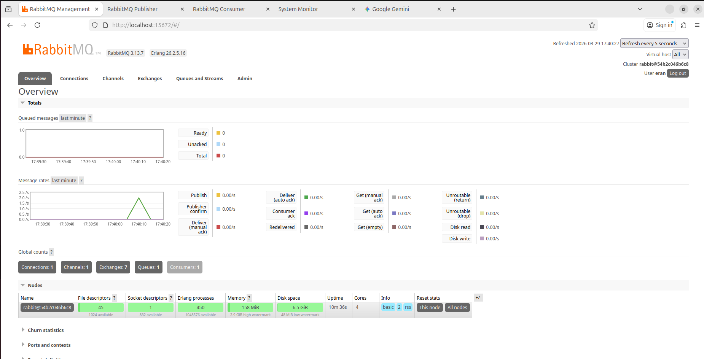
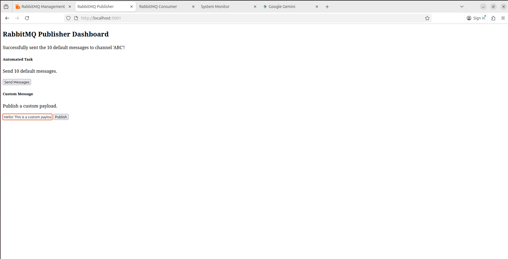
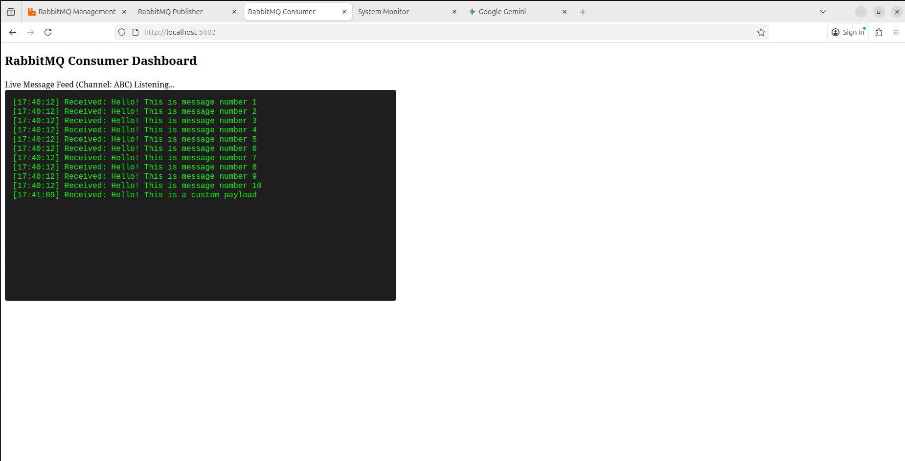
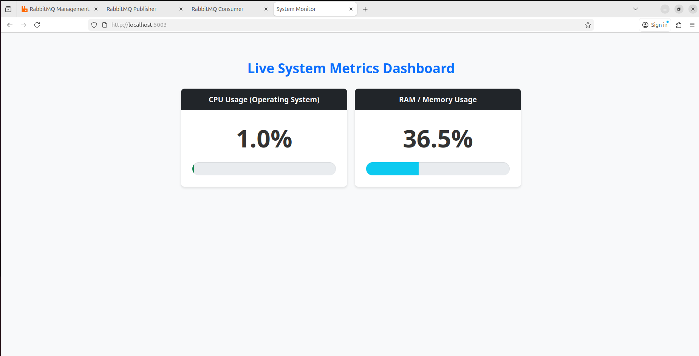
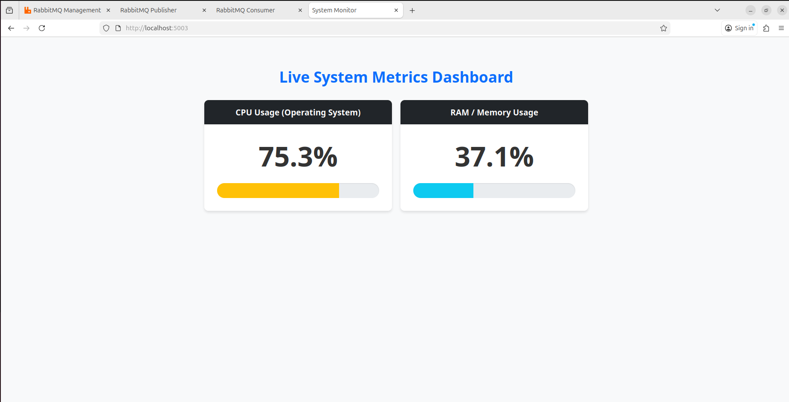
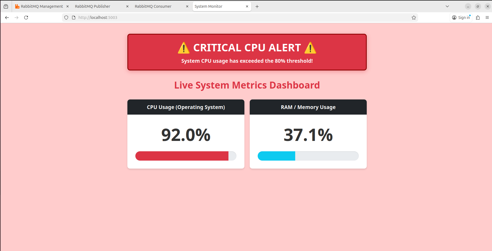

# Qualitest / Elbit Systems - Home Assignment

This repository contains the deliverables for the DevOps/SRE technical assignment. The project has been architected using a **Microservices** approach, containerizing RabbitMQ and three custom Python/Flask web applications to provide real-time, interactive dashboards.

---

## Section 1: Implementing a Publisher and Consumer (RabbitMQ)

This section implements a robust message queuing system using RabbitMQ and Python. Instead of static CLI scripts, the Publisher and Consumer are independent microservices with their own web interfaces.

### Key Implementation Details:
* **Container Orchestration:** The entire stack (Broker, Publisher, Consumer, Monitor) is orchestrated via a single `docker-compose.yml`.
* **Security:** Custom credentials (`eran` / `likes-elbit-and-qualitest`) are used for the RabbitMQ broker, passed securely via environment variables.
* **Resilience:** The Python services utilize a **retry-on-failure** connection loop. This handles container race conditions by ensuring scripts wait for the broker to be fully "Ready" before attempting a connection.
* **Background Workers:** The Consumer application runs a daemonized background thread to continuously consume messages without blocking the Flask web server.

### Setup & Execution

1. **Prerequisites:** Docker and Docker Compose installed.
2. **Launch the Stack:** Navigate to the root directory and run:
   ```bash
   sudo docker-compose up --build
   ```

### 1. The RabbitMQ Broker
To observe the message queues, channels, and authenticated connections visually:
* **URL:** `http://localhost:15672`
* **Credentials:** `eran` / `likes-elbit-and-qualitest`



### 2. The Publisher Web App
A web interface to push payloads to the queue. It includes a button to fulfill the assignment requirement (send 10 default messages) and a form for custom payloads.
* **URL:** `http://localhost:5001`



### 3. The Consumer Web App
A dashboard utilizing JavaScript polling to fetch new messages from the backend API, displaying them in a live, auto-scrolling terminal window.
* **URL:** `http://localhost:5002`



---

## Section 2: Creating a Service to Monitor CPU Usage and Send Alerts

### 1. Implementation Description
To monitor the host OS CPU usage, I implemented a custom Flask application (`monitor_app`) using the `psutil` library. 

**Architectural Note:** Because `psutil` inside a standard Docker container only measures the container's isolated usage, this specific service is configured with `pid: "host"` in the `docker-compose.yml`. This allows the container to break out of process isolation and accurately report the underlying Ubuntu Host Machine's CPU and RAM.

### 2. Normal State & Live Dashboard
The service polls the OS every 2 seconds. The `interval=0.5` parameter in `psutil` ensures a true average CPU usage is calculated, preventing false positives from momentary sub-second spikes.
* **URL:** `http://localhost:5003`



### 3. Live Simulation & Stress Test
To verify the dynamic alerting logic (Yellow Warning at 60%, Red Critical Alert at >80%), a live stress test was conducted. 

**Step 1: Induce Artificial Load**
In a separate terminal, a synthetic load was applied to the host machine to gradually increase the CPU usage:
```bash
yes > /dev/null & yes > /dev/null & yes > /dev/null & yes > /dev/null & yes > /dev/null &
```

**Step 2: The Warning State (60% Threshold)**
As the load increased past 60%, the dashboard successfully shifted the progress bars to a yellow warning state, providing operators with an early indication of rising system stress.



**Step 3: Verification of Critical Alert (>80% Threshold)**
As the cumulative load pushed the system past the 80% threshold, the dashboard dynamically shifted to a critical UI state, triggering the red alert banner to immediately notify operators of the breach.



**Step 4: Graceful Teardown and Cleanup**
To stop the synthetic load and tear down the microservices infrastructure:
```bash
killall yes
sudo docker-compose down
```

---

## Production Scalability & Advanced Observability

While the current implementation provides immediate visibility via custom dashboards, a production environment requires a shift from "reactive scripts" to "proactive observability."

### Enterprise Monitoring with Grafana & Prometheus
In a production-grade infrastructure, I would replace local polling with a centralized observability stack:
* **Metrics Collection:** Use a **Prometheus Node Exporter** to collect host metrics.
* **Visualization & Alerting:** Use **Grafana** for historical trends and **Alertmanager** to route critical >80% spikes to Slack/PagerDuty.
* **Frontend Optimization:** Replace AJAX polling with **WebSockets** or **Server-Sent Events (SSE)** to push updates to the UI, reducing HTTP request overhead.

### Cloud Orchestration (Kubernetes/GCP)
If this service encountered sustained high CPU usage in production, we would utilize Kubernetes native features:
* **Horizontal Pod Autoscaler (HPA):** We would configure an HPA resource to monitor CPU metrics. When usage breaches the 80% threshold, Kubernetes automatically spins up additional replicas (Pods) to distribute the load.
* **RabbitMQ in K8s:** RabbitMQ should be deployed as a **StatefulSet** using the RabbitMQ Cluster Operator. This ensures data persistence.
* **Competing Consumers:** If the queue depth grows too large, we can scale the Consumer Deployments. RabbitMQ natively supports round-robin message distribution across multiple consumer pods.

---

## Bonus Question: Understanding and Moving Multicast Messages

### 1. Definition and Use Cases
**Multicast** is a "one-to-many" network communication model where a single data stream is sent to a specific group of subscribers. It uses Class D IP addresses (224.0.0.0/4).

**Typical Use Cases:**
* **IPTV:** Streaming live video to thousands of users without duplicating bandwidth.
* **Finance:** Distributing real-time stock market data to multiple trading desks simultaneously.

### 2. Solutions for Moving Multicast Between Networks
Standard routers block multicast by default. To route messages between networks:
* **IGMP:** Used by hosts to join/leave groups on the local network.
* **PIM (Protocol Independent Multicast):** The routing protocol used between routers to determine which paths need the multicast traffic.
* **GRE Tunneling:** Encapsulating multicast packets inside standard unicast IP packets to traverse non-multicast-aware networks (like the public internet).

### 3. Example Scenario
**Scenario:** A trading server in NY needs to send a multicast feed (`239.1.1.1`) to a branch in London over the internet.
**Solution:** A GRE Tunnel is established between the NY and London routers. The NY router encapsulates the multicast packets into unicast packets. Once they arrive in London, the router decapsulates them and forwards the original feed to the analysts who joined the group via IGMP.