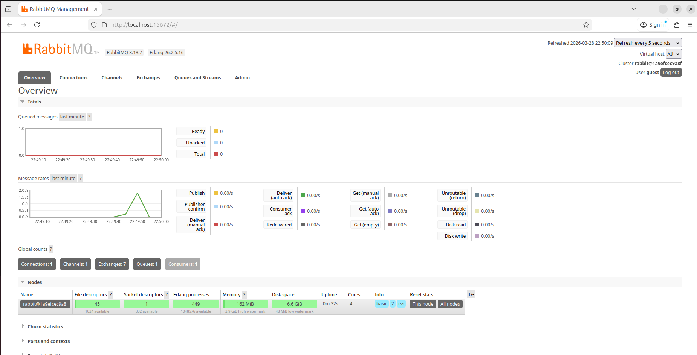

# Qualitest / Elbit Systems - Home Assignment

This repository contains the deliverables for the DevOps/SRE technical assignment.

---

## Section 1: Implementing a Publisher and Consumer (RabbitMQ)

This section implements a simple message queuing system using Python and RabbitMQ. The publisher sends 10 messages to the channel "ABC", and the consumer subscribes to the same channel to print them. The entire architecture is fully containerized for a zero-configuration startup.

### Setup & Execution

1. **Prerequisites:** Docker and Docker Compose installed on your machine.
2. **Launch the Stack:** Navigate to the `section1_mq` directory and run the following command to build the images and start the environment:
   ```bash
   cd section1_mq
   sudo docker-compose up --build
   ```

3. **Expected Output:**
   Once the RabbitMQ broker initializes, the publisher and consumer containers will connect automatically. You will see the messages being sent and received in real-time in your terminal:
   ```text
   mq_publisher | [*] Publisher connected to rabbitmq. Sending messages to 'ABC'...
   mq_publisher |  [x] Sent 'Hello! This is message number 1'
   mq_consumer  | [*] Waiting for messages on 'ABC' at rabbitmq. To exit press CTRL+C
   mq_consumer  |  [x] Received Hello! This is message number 1
   mq_publisher |  [x] Sent 'Hello! This is message number 2'
   mq_consumer  |  [x] Received Hello! This is message number 2
   ...
   mq_publisher |  [x] Sent 'Hello! This is message number 10'
   mq_consumer  |  [x] Received Hello! This is message number 10
   mq_publisher | [*] All messages sent. Connection closed.
   ```

   

4. **RabbitMQ Management Dashboard:**
   To observe the message queues, connections, and system metrics visually:
   * Open your web browser and navigate to: `http://localhost:15672`
   * **Username:** `eran`
   * **Password:** `likes-elbit-and-qualitest`
   * Navigate to the **"Queues"** tab to see the `ABC` channel metrics.

5. **Tear Down:**
   To cleanly stop the environment and remove the containers, run:
   ```bash
   sudo docker-compose down
   ```

---

## Section 2: Creating a Service to Monitor CPU Usage and Send Alerts

### 1. Implementation Description
To create a reliable service that monitors CPU usage and triggers alerts, I have implemented a background daemon script using Python. A working version of this script, along with a high-level pseudo-code file, is located in the `section2_cpu_monitor` directory.

### 2. Language and Libraries
* **Programming Language:** Python 3.x
* **Core Library:** `psutil` (Python System and Process Utilities). This is the industry standard for retrieving information on running processes and system utilization.
* **Standard Libraries:** `time` (for continuous monitoring intervals) and `logging` (to maintain a local historical record of CPU spikes and act as the immediate alerting output).

### 3. Continuous Monitoring Method
The service utilizes an infinite `while True` loop to act as a continuous daemon. Inside the loop, it calls `psutil.cpu_percent(interval=1)`. 
Setting the `interval` parameter to 1 second is crucial; it blocks the script for 1 second to compare system CPU times, providing an accurate, non-blocking average rather than an instantaneous spike. To ensure the monitoring script itself does not consume unnecessary CPU cycles, a `time.sleep(5)` interval pauses the execution between checks.

### 4. Alerting Method
When the CPU threshold (80%) is breached, the system triggers an alerting mechanism. In the provided solution, it uses the `logging` module to stream a `CRITICAL ALERT` to the console and immediately writes it to a persistent local file (`cpu_alerts.log`). In a production environment, this would integrate with `smtplib` (for email relays) or a webhook via the `requests` library (Slack/PagerDuty).

### 5. Live Simulation & Stress Test
To verify the monitoring and alerting logic, a live stress test was conducted across multiple terminals to simulate a critical CPU spike.

This is the full `cpu_alerts.log` output while inducing a stress test:
```text
2026-03-28 22:49:13,792 - [INFO] - Starting CPU Monitor. Alert threshold set to 80.0%
2026-03-28 22:49:13,792 - [INFO] - Press CTRL+C to stop.
2026-03-28 22:49:14,825 - [INFO] - CPU usage normal: 1.2%
2026-03-28 22:49:20,829 - [INFO] - CPU usage normal: 17.3%
2026-03-28 22:49:26,830 - [INFO] - CPU usage normal: 75.3%
2026-03-28 22:49:32,832 - [WARNING] - CRITICAL ALERT: CPU usage exceeded threshold! Current usage: 99.5%
2026-03-28 22:49:38,833 - [WARNING] - CRITICAL ALERT: CPU usage exceeded threshold! Current usage: 98.0%
2026-03-28 22:49:44,836 - [WARNING] - CRITICAL ALERT: CPU usage exceeded threshold! Current usage: 86.5%
2026-03-28 22:49:50,839 - [WARNING] - CRITICAL ALERT: CPU usage exceeded threshold! Current usage: 98.7%
2026-03-28 22:49:56,841 - [WARNING] - CRITICAL ALERT: CPU usage exceeded threshold! Current usage: 84.2%
2026-03-28 22:50:50,866 - [WARNING] - CRITICAL ALERT: CPU usage exceeded threshold! Current usage: 93.7%
2026-03-28 22:50:56,892 - [INFO] - CPU usage normal: 7.3%
2026-03-28 22:51:02,922 - [INFO] - CPU usage normal: 1.5%
2026-03-28 22:51:08,928 - [INFO] - CPU usage normal: 0.3%
2026-03-28 22:51:10,511 - [INFO] - Monitoring stopped by user.
```

Monitoring log breakdown:

**Step 1: Start the Monitor (Terminal 1)**
The monitor was started within a virtual environment. Initial CPU usage was stable and below the 80% threshold.
```text
2026-03-28 22:49:13,792 - [INFO] - Starting CPU Monitor. Alert threshold set to 80.0%
2026-03-28 22:49:13,792 - [INFO] - Press CTRL+C to stop.
2026-03-28 22:49:14,825 - [INFO] - CPU usage normal: 1.2%
2026-03-28 22:49:20,829 - [INFO] - CPU usage normal: 17.3%
```

**Step 2: Induce Artificial Load (Terminal 2)**
Synthetic CPU load was applied using background processes, causing the usage to jump to 75.3% (approaching, but not breaching, the threshold).
```bash
eran@Ubuntu:~$ yes > /dev/null & yes > /dev/null & yes > /dev/null &
[1] 23262
[2] 23263
[3] 23264
```
```text
2026-03-28 22:49:26,830 - [INFO] - CPU usage normal: 75.3%
```

**Step 3: Launch Message Queue Stack (Terminal 3)**
The RabbitMQ Docker Compose stack from Section 1 was launched (`sudo docker-compose up --build`). This additional compute load successfully pushed the CPU to 99.5%, immediately triggering the critical alerts.
```text
2026-03-28 22:49:32,832 - [WARNING] - CRITICAL ALERT: CPU usage exceeded threshold! Current usage: 99.5%
2026-03-28 22:49:38,833 - [WARNING] - CRITICAL ALERT: CPU usage exceeded threshold! Current usage: 98.0%
2026-03-28 22:49:44,836 - [WARNING] - CRITICAL ALERT: CPU usage exceeded threshold! Current usage: 86.5%
2026-03-28 22:49:50,839 - [WARNING] - CRITICAL ALERT: CPU usage exceeded threshold! Current usage: 98.7%
```

**Step 4: Graceful Teardown**
The Docker stack was shut down (`sudo docker-compose down`) and the background load was terminated (`killall yes`). The CPU immediately stabilized, and the alerts successfully ceased.
```bash
eran@Ubuntu:~$ killall yes
[1]   Terminated              yes > /dev/null
[2]-  Terminated              yes > /dev/null
[3]+  Terminated              yes > /dev/null
```
```text
2026-03-28 22:50:56,892 - [INFO] - CPU usage normal: 7.3%
2026-03-28 22:51:02,922 - [INFO] - CPU usage normal: 1.5%
2026-03-28 22:51:08,928 - [INFO] - CPU usage normal: 0.3%
2026-03-28 22:51:10,511 - [INFO] - Monitoring stopped by user.
```

---

## Bonus Question: Understanding and Moving Multicast Messages

### 1. What is Multicast and its Typical Use Cases?
Multicast is a network communication protocol where a single stream of data is transmitted to multiple, specific recipients simultaneously. Unlike unicast (one-to-one) or broadcast (one-to-all), multicast is a "one-to-many" model utilizing specific IP address ranges (Class D: 224.0.0.0 to 239.255.255.255). Clients who wish to receive the data must actively "subscribe" to a specific multicast group address.

**Typical Use Cases:**
* **Streaming Media:** IPTV or live corporate video broadcasts where sending a separate unicast stream to every viewer would exhaust network bandwidth.
* **Financial Services:** High-frequency trading platforms distributing live stock ticker data to hundreds of endpoints simultaneously with minimal latency variance.
* **Routing and Discovery:** Network protocols like OSPF use multicast to discover peers and share routing tables on a local network.

### 2. Solutions for Moving Multicast Between Networks
Standard network routers are typically configured to drop multicast and broadcast traffic to prevent network storms. To route multicast messages across different subnets or WANs, specific protocols are required:

* **IGMP (Internet Group Management Protocol):** Used on the local area network (LAN). Client machines use IGMP to signal to their local router that they want to join a specific multicast group.
* **PIM (Protocol Independent Multicast):** The routing protocol used between routers across the wider network to forward multicast traffic. PIM Sparse Mode (PIM-SM) is the most common, ensuring traffic is only forwarded to network segments where downstream clients have explicitly requested it.
* **Tunneling (GRE):** If multicast traffic needs to traverse a network that does not inherently support multicast routing (such as the public internet), the multicast packets can be encapsulated inside standard unicast IP packets using a GRE (Generic Routing Encapsulation) tunnel. 

### 3. Example Scenario
**The Setup:** A financial institution has its main trading server in **Network A (New York)** and a group of analysts in **Network B (London)**. The server needs to send a live, high-volume stock price feed (multicast group `239.1.1.1`) to the analysts. The two networks are connected via a standard ISP connection over the public internet, which drops multicast packets.

**The Solution:**
1. The analysts in London open their trading software, which sends an **IGMP Join** request for `239.1.1.1` to the London Edge Router.
2. Network Engineers establish a **GRE Tunnel** between the New York Edge Router and the London Edge Router. 
3. The New York server starts broadcasting the UDP multicast feed.
4. The New York router captures these multicast packets, encapsulates them inside standard unicast IP packets, and routes them through the GRE tunnel across the internet.
5. The London router receives the unicast packets, decapsulates them to reveal the original multicast payload, and forwards the feed to the local analysts who requested it via IGMP.